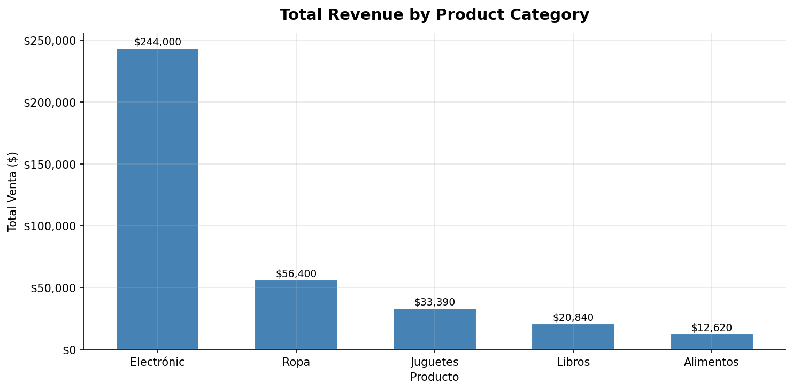
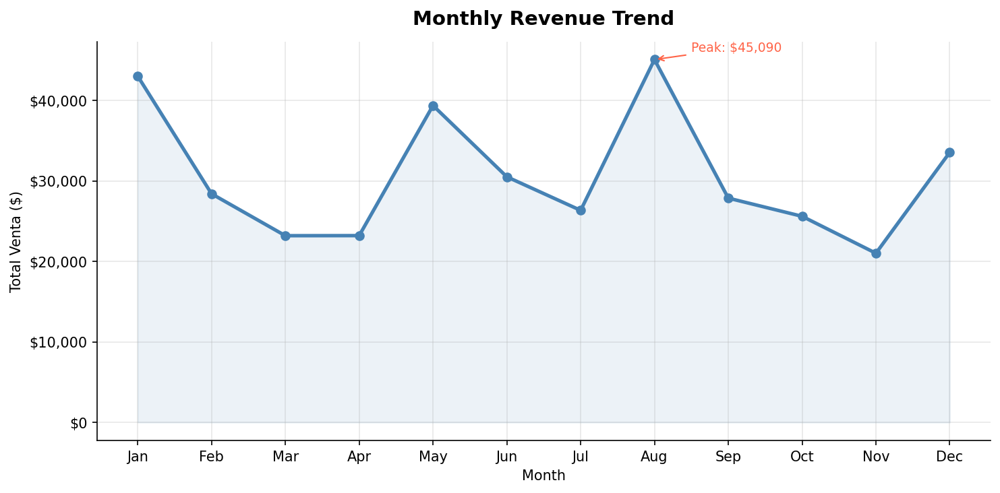
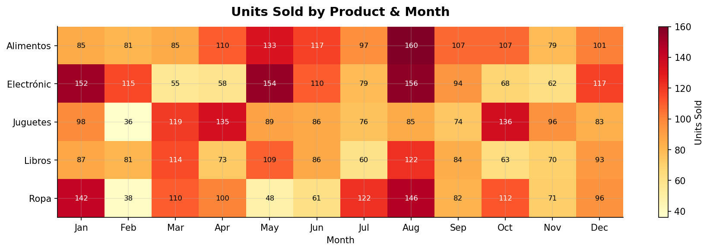

# Tienda Sales Analysis

Exploratory analysis and revenue forecasting on a retail store dataset (~1,050 sales records across two stores).

---

## Project Structure

```
├── Datos_Ventas_Tienda.csv          # Store 1 raw data (1,000 records)
├── Datos_Ventas_Tienda2.csv         # Store 2 raw data (50 records)
├── Tienda_Ventas_Analysis.ipynb     # EDA: cleaning, merging, key metrics
├── Tienda_Visualizations.ipynb      # Charts: revenue, trend, heatmap
├── Tienda_Forecasting.ipynb         # Time-series forecast (linear trend)
├── charts/
│   ├── revenue_by_product.png
│   ├── monthly_trend.png
│   └── heatmap_product_month.png
└── README.md
```

---

## Dataset

Each record contains:

| Column | Description |
|---|---|
| `Fecha` | Sale date |
| `Producto` | Product category |
| `Cantidad` | Units sold |
| `Precio Unitario` | Unit price |
| `Total Venta` | Total revenue for that sale |

---

## Key Findings

### Best-selling product
**Alimentos** led in total units sold (1,262 units), followed by Electronics.

### Peak revenue month
**August** was the highest-revenue month with **$45,090** in total sales.

---

## Visualizations







---

## Forecasting

The forecasting notebook fits a **linear trend model** on monthly aggregated revenue and projects the next 3 months.

> With only ~12 months of data, a simple linear model is more appropriate and honest than a seasonal one. More historical data would allow for a fuller time-series approach.

---

## Setup

```bash
pip install pandas matplotlib statsmodels
```

Then run the notebooks in order:
1. `Tienda_Ventas_Analysis.ipynb`
2. `Tienda_Visualizations.ipynb`
3. `Tienda_Forecasting.ipynb`

---

## Tech Stack

- Python 3.x
- pandas
- matplotlib
- statsmodels
